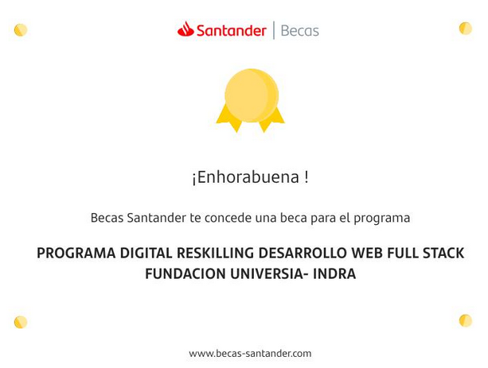

El pasado 9 de marzo fui informado de que había sido seleccionado para cursar el Bootcamp de Desarrollo Web Full Stack que [Becas Santander](https://www.becas-santander.com/es/index.html) lleva a cabo en colaboración con [Fundación Universia](https://jobs.universia.net/) [Indra](https://www.indracompany.com/) y [The Bridge](https://www.thebridge.tech/).

La beca, denominada **Programa DIGITAL RESKILLING Desarrolo Web Full Stack para estudiantes con Discapacidad**, me permite acceder al Bootcamp de formación impartido por The Bridge desde marzo a noviembre, y en él se impartirán los siguientes módulos:

- Módulo 0: Ramp Up 
- Módulo 1: Javascript Avanzado 
- Módulo 2: Backend Development 
- Módulo 3: Frontend Con React 
- Módulo 4: Devops
- Módulo 5: Lanza Tu Carrera Digital 

{: .float-right :}

Para saber más: [Página de la beca en the Bridge](https://www.thebridge.tech/curso/bootcamp-indra-fundacion-universia#solicitud-beca)